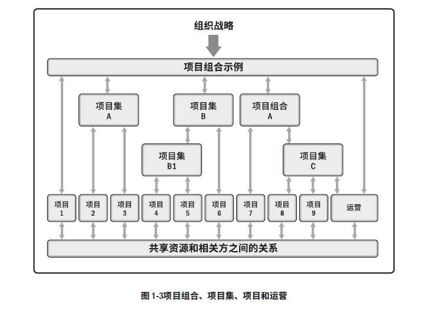
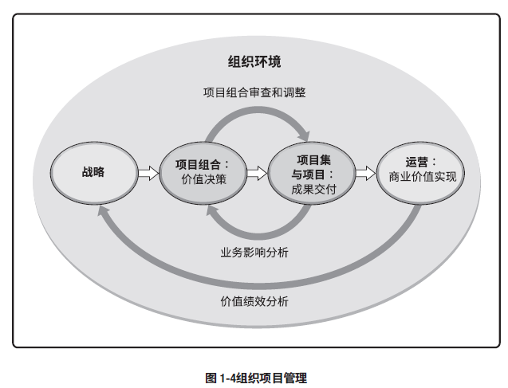

# IT项目管理第一次个人作业

## 前言
这是中山大学数据科学与计算机学院软件工程专业的第一次个人作业

## 问题  
讨论 projects、programs、和 portfolio 之间的关系以及对企业成功的贡献；以及与operations以及OPM之间的关系。  

* projects、programs、 portfolio 、 operations 和 OPM 的概念  
    | 名词 | 概念 |
    |-|-|
    |projects(项目)|项目是为创造独特的产品、服务或成果而进行的临时性工作|  
    |programs(项目集)|项目集是一组相互关联且被协调的项目、子项目和项目活动，以便获得分别管理所无法获得的效益|  
    |portfolio(项目组合)|项目组合是为实现战略目标而组合在一起管理的项目、项目集、子项目组合和运营工作的集合 |  
    |operations(运营管理)|运营管理关注产品的持续生产和（或）服务的持续运作。它使用最优资源满足客户要求，来保证业务运作的持续高效。它重点管理那些把各种输入（如材料、零件、能源和劳力）转变为输出（如产品、商品和（或）服务）的过程。|  
    |OPM(组织级项目管理)|OPM 指为实现战略目标而整合项目组合、项目集和项目管理与组织驱动因素的框架。|
* 关系与区别   
    * projects与programs:  
        项目管理注重项目本身的相互依赖关系，以确定管理项目的最佳方法。项目集管理注重作为组成部分的项目与项目集之间的依赖关系，以确定管理这些项目的最佳方法
    * projects、programs与portfolio:  
        从组织的角度来看：  
        * 项目集和项目管理的重点在于以“正确”的方式开展项目集和项目
        * 项目组合管理则注重于开展“正确”的项目集和项目  

        项目集管理和项目组合管理的生命周期、活动、目标、重点和效益都与项目管理不同；但是，项目组合、项目集、项目和运营通常都涉及相同的相关方，还可能需要使用同样的资源，而这可能会导致组织内出现冲突    

        projects、programs、portfolio关系如下图:  
          

    * projects、programs、portfolio与operations、OPM:  
        项目组合、项目集和项目均需符合组织战略，或由组织战略驱动，并以不同的方式服务于战略目标的实现:  
        * 项目组合管理通过选择适当的项目集或项目，对工作进行优先排序，以及提供所需资源，来与组织战略保持一致。
        * 项目集管理对其组成部分进行协调，对它们之间的依赖关系进行控制，从而实现既定收益。
        * 项目管理使组织的目的和目标得以实现。  
        
        其关系如下图:  
            
* 案例  
    我现在某游戏中心后台实习，就以我们为例:  
    * 后台采取微服务的机制，每个功能、中间构件对应一个微服务，例如权限认证、SQLHelper，搭建一个微服务是projects，他们有具体的目标
    * 很多需求或项目并不只依靠一个微服务，可能由多个微服务共同完成，也可能依靠其他已完成项目，例如画像分析系统，这样的需求属于programs  
    * 部门为了更好的实现战略目标，提高开发效率，在内部设立精品、小游戏等，这些组属于portfolio，实际上是将一些具有共性的项目进行了组合  
    * 各个组内负责人为项目设定优先级、分配资源、管理项目以完成部门任务与目标；项目负责人(主要是开发人员)，选择合适的微服务，或搭建新的微服务来完成项目需求。这些属于OPM  