# IT项目管理团队作业-项目前期研究

## 前言  
这是中山大学数据科学与计算机学院软件工程专业IT项目管理的第一次团队作业博客部分，由“全都实习没人干活组”博客小队完成。  

## 成员贡献  

## 中大人IT生活攻略  

### 服务整理  
下面是我们小队成员收集到的一些中大已有的典型IT服务  
服务名|分类|部分功能简述|
-|-|-|
中大APP|生活|专门为中山大学打造的手机客户端软件，提供了一套完善的教学管理系统|  
中山大学信息技术服务帮助台|办事|提供IT服务|
中山大学校园卡公众号|生活|提供中大校园卡服务|
中大教务系统|办事|提供最新、最全、最权威的教务信息以及退选课等操作|
中大体育部|办事|提供场馆预定、体育章查询等服务|  
图书馆|学习||
成绩查询|学习||
课程表|学习||
校园地图|生活||
校车|生活||
日程|生活||
一卡通服务|生活||
IT服务|办事||
新闻资讯|娱乐||
校园活动|生活||
学长帮忙|生活||  

### 生活攻略  
以下为小组成员编写的部分软件服务生活攻略
* 中大APP篇  
  一、用户初始界面

  1.1 功能分析

  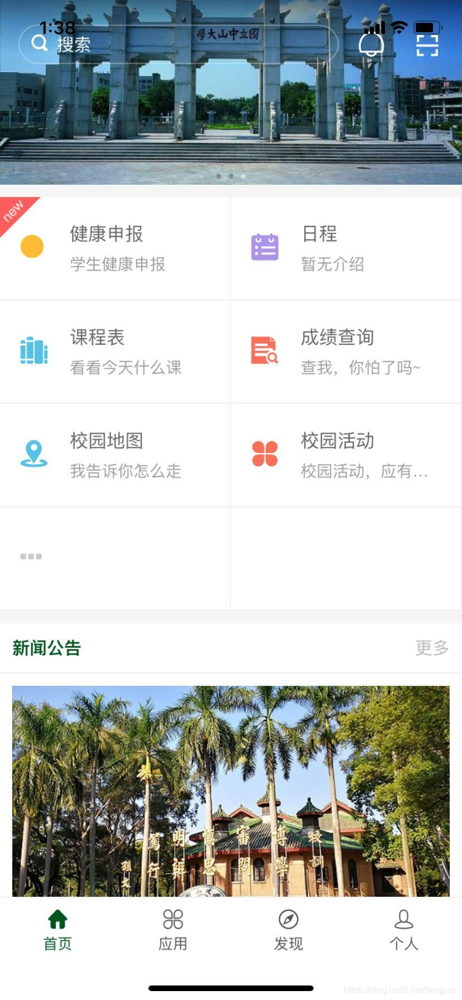

  如上图，打开中大APP，初始的用户交互界面如上。

  首先，在界面的最顶端有搜索窗口。用户可以通过键入关键字来进行功能搜索，从而进入相应的功能界面，如下：

  

  点击右上方的“取消”按钮，就可以返回首页。

  在搜索窗口的右端，还有两个功能图标，分别是“校园通知”图标和“二维码扫描”图标。点击“校园通知”图标，则可以进入“校园”通知功能页面，查看相应的校园通知，如下：

  

  如上图，用户可以在校园通知页面查看已订阅的通知，如校车通知，个人通知等。用户可通过上方的搜索窗口进行相应的通知搜索。最后，用户可以点击右上角的“订阅设置”功能图标进入订阅设置页面，来进行通知的订阅或取消订阅操作，如下：

  

  点击返回，即可返回“校园通知”页面。再次点击返回，即可返回首页。

  接下来，在滚动图片下方就是功能选择窗口。用户可以在首页通过点击相应的功能按钮进入相应的功能界面。

  为了在首页点击某一功能按钮，用户需要点击“...”按钮进入“应用市场界面”并选择需要点击的功能，点击“加到首页”按钮将该功能加入首页，如下：

  

  

  点击返回，即可返回首页。

  在首页下方还有“新闻公告”区域，用户可点击上方“更多”查看更多相关新闻公告；“消息”区域，用户可点击上方“更多”查看更多相关消息；“校园卡”区域，用户可在该区域查看校园卡余额；“课程”区域，用户可在该区域查看正在进行中的课程以及下堂课的信息，如下:

  

  

  最后，在首页最下方有界面选择区域。用户选择“应用”按钮可直接进入全部功能选择页面，选择“发现”按钮可以发现相关校园动态，选择“个人”按钮可以查看个人信息：

  

  

* 中山大学信息技术服务帮助台篇  

  # 微信公众号服务分析

  ## 1、中山大学信息技术服务帮助台  

  帮助台是`校园网信息技术服务与支持`的统一入口，用户可以通过电子邮件、语音呼叫和FAQ知识库来获取帮助。主页面如下：

    

  

  ### 功能分析
  - `NetID的绑定和解绑`：该功能用于绑定和解绑学生的网络ID和微信校园网服务  

    `绑定界面`：输入NetID和密码或者通过微信扫码可以绑定NetID  

      

  - `个人网络续费`：该功能用于校园网费用充值

    `充值界面`：可以清晰地看到校园网使用状态同时选择续费的时间

      

  - `校外网络续费`：该功能针对非在校人员的网络缴费

    `缴费界面`：通过输入身份证号查询网络服务  

      

  - `常见问题`：该模块主要是对用户常见问题的解答，问题如下：

      

* 中大APP各功能篇  

  ## 概述
  对于21世纪信息网络的快速发展的时代，学生的日常校园活动很多都需要借助网络的力量查询相关校园信息，中山大学app，提供了一个良好的信息平台，几乎全方面地涵盖了个人想了解的信息，让中大学子快速地适应大学生活。
  ### 模块功能分析
  主要有用模块如下：校园学习，校园导航，校园生活，校园新闻，以及学生交流平台。
  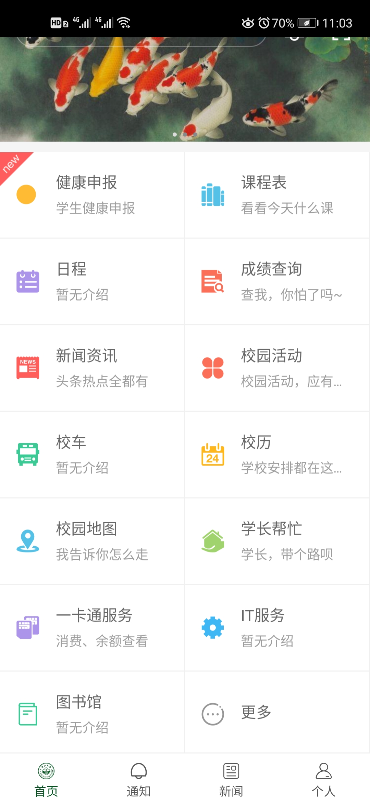

  * 校园学习         
    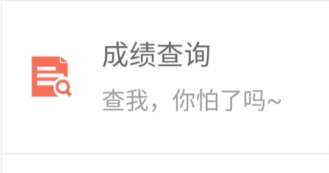   
    点击成绩查询，可以查询到过去相关课程的相关成绩信息，包括任课老师，学分，教学班人数和课程成绩。课程成绩分为平时成绩和期末考试成绩权重与分数。为了区分是否及格，分数用绿色表示及格，红色代表需要重修或者补考。除此之外，可以了解到课程排名以及年纪排名，基本上想了解的成绩信息都涵盖了。唯一不足的就是没有一个学期所有成绩的平均绩点，需要单独去教务系统上查询，不太方便。 
   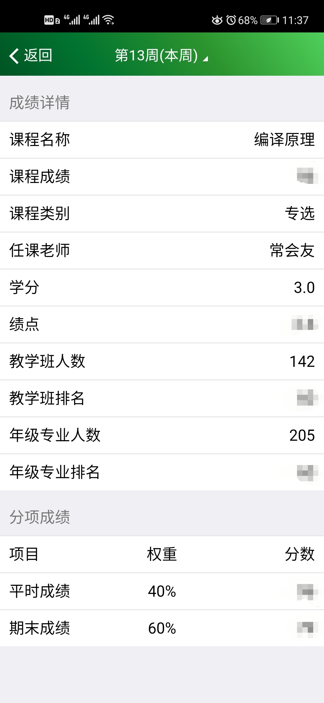

   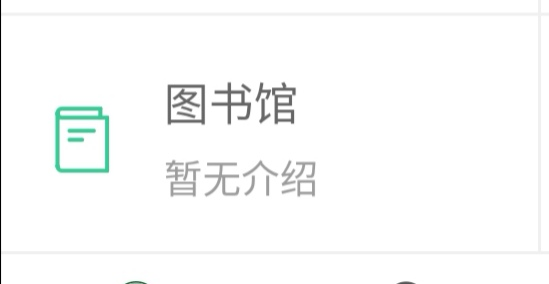  

   点击图书馆，可以查询到自己借书还书以及图书超期情况。比较简单，个人建议增加一个链接，学生可以点击链接跳转到中大图书馆的网页，进行图书查询以及相关图书事项，方便中大学子。

  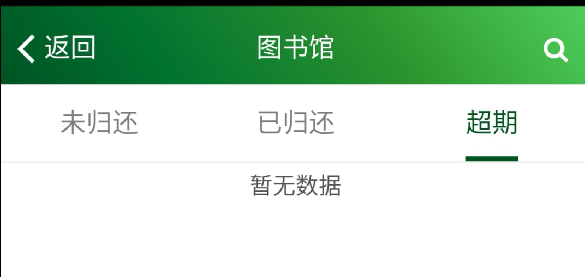
   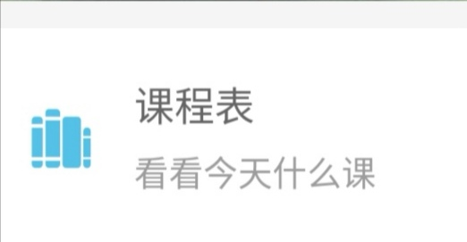  

  点击课程表，查询这一周的课程，点击相关课程，可以看到课程详细信息，简洁明了。例如： 

  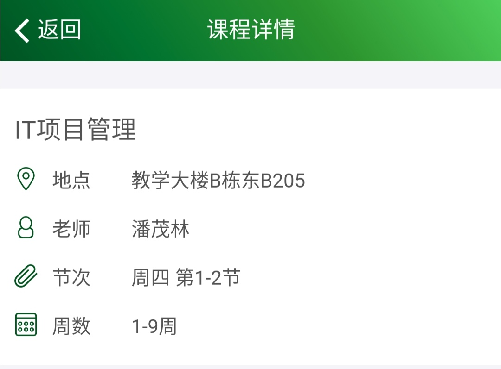  

  * 校园导航        
  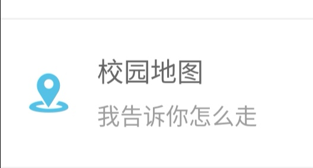   

  点击校园地图，查询查询到各大校区地图和周边信息。 

  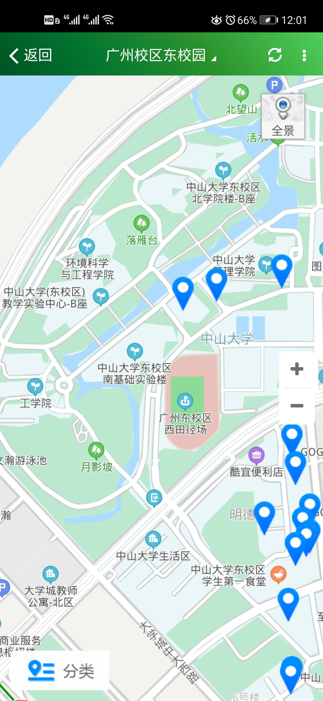   

  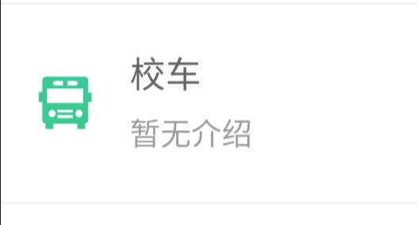   

  点击校车，查询各大校园往返的班车信息。 

  * 校园生活   
  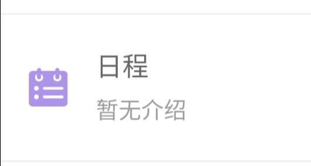

  日程，简单来说，就是日期和备忘录的结合。点击进入可以看到今日信息与相关日程。点击特定日期增加日程活动。比较人性化地设计是增加了提醒功能，以免学生遗忘待办事项。   

  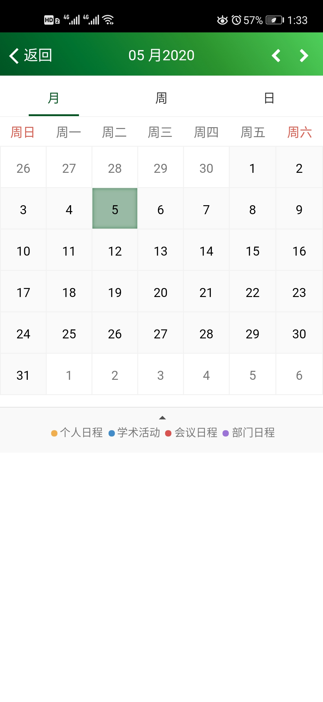  
  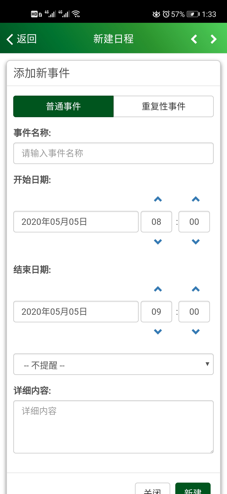  

  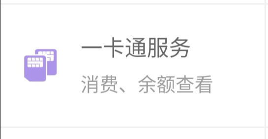   

  一卡通服务，查看余额以及交易明细(一方面查看近期学生卡使用情况，另一方面查看学生卡弄丢之后有无使用)，还可以进行挂失解锁申请。

      

  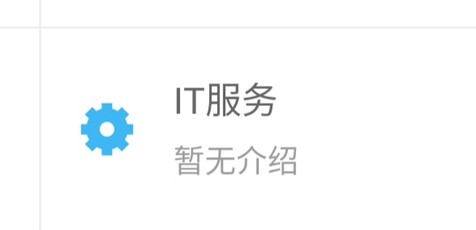   

  IT服务，略(不太清楚)

     

  校历，查看学校对应日期的相关安排。(大部分学生应该关注地是放假的相关日期)
  * 校园新闻        
     

  新闻咨讯，方便学生了解最新学校以及国家大事，为国家和中大自豪！(个人建议能在每篇报道下面增加一个评论区，让更多学生能够畅所欲言，互相交流心得，表达自己的看法，加深自己的理解)

     

  校园活动，这个模块太过宽泛，因为校园活动有很多方面，比如学校组织的活动，学院组织，团委学生会组织以及社团组织的活动等，因此学校在这个模块用处基本空白，因为信息搜集比较麻烦，而且大部分学生都是根据特定公众号推送来获取最新活动信息。

  * 学生交流平台     
      

  学长帮忙，简单来说，就是一个生活问题咨询平台。有一定的作用，但是，也有许多信息没有及时地回答，问题没有很好地解决。

  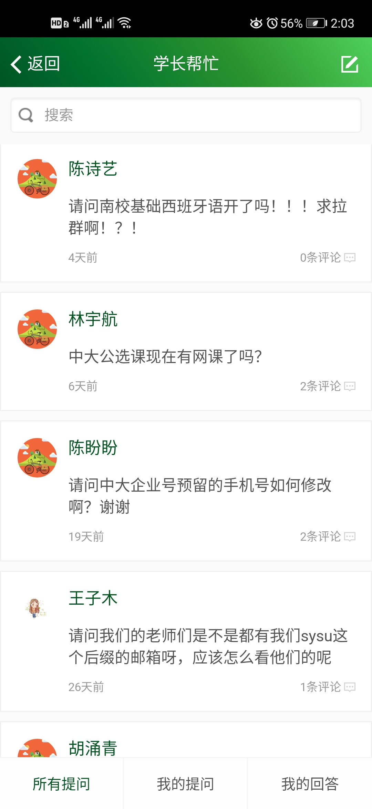

* 中大校园卡公众号篇  

  一、用户界面

  

  功能分析
  主要功能分为3个类别，卡片业务、学杂费业务、其他业务。

  选择卡片业务，内含账户余额，交易记录，失卡寻主，挂失与解挂。校园卡充值五个功能。

  

  点击账户余额，将会返回校园卡内的余额数量，校园卡状态以及补助金额的数量。

  

  点击交易记录，将会进入交易查询界面，可以查询当天、近三天、近一周的交易明细，也可以通过输入具体日期查询交易明细。

  

  点击失卡寻主，可以将自己捡到的他人意外丢失的校园卡的信息登记在案，系统将会在半小时内将消息发送到丢卡人微信中。

  

  点击挂失与解挂，进入到挂失界面，可以将自己的校园卡进行挂失，挂失后校园卡无法进行使用，用于避免他人捡到卡后进行消费或其他用途。

  

  点击校园卡充值，进入充值界面，可以给自己或者他人进行充值

  

  选择学杂费业务，内涵两个功能，欠费查询和交费记录，点击后返回相应的欠费/交费界面。

  

  

  选择其他业务，内涵捡获卡查询，解除微信绑定，维权，最新通知和服务部分布五个功能。

  

## 中大人的移动生活攻略

###  学习资源共享平台项目分析与设计

* 项目背景  
  中山大学拥有数万在校学生、六十余院系，然而师生间没有一个统一的学习资源共享平台。各院系、学科、课程的评价、作业、考试等信息多分散于零散的平台或公众号中。以数据院为例，著名的SYSU-EXAM存在于github上，为数据院学生提供许多便利。然而受专业、政治等影响，SYSU_EXAM存在网络较慢、推广困难的问题，目前只被数据院学生所利用。比较通用的学习平台雨课堂，虽然功能齐全、使用方便，但由于其并非定制产品，无法成为校内统一渠道。

* 需求概述  
  为中大师生提供一个统一、便利的学习资源共享平台，建设中大全体师生的共享网盘，为教学、学习提供便利。

* 功能设计

  * 资源共享

    师生可将作业、试卷、复习题等上传至本平台，审核通过后（未经许可的资料将不被通过）将会被所有中大人所见。采取多级标签、分类整理的形式，用户可快速找到在学的课程并筛选出需要的学习资源。

  * 课程评价

    授课老师与选课学生可在平台中创建课程并进行评价，评价内容对所有人可见，作为学生选课参考的依据。

  * 课程交流

    为每学期在授课程建立交流渠道，师生可在平台中讨论、发布作业或资源、提交作业等，甚至可能成为中大的网课教学平台。  

* 对比  

  对比国内知名平台雨课堂和SYSU-Exam。

  雨课堂技术成熟、功能较全，但不是定制产品，不能作为校内通用。

  SYSU-Exam虽为定制产品，但是挂载于github，服务不稳定，且提供功能较少。

  我们的项目取长补短，适合作为校内通用平台。

  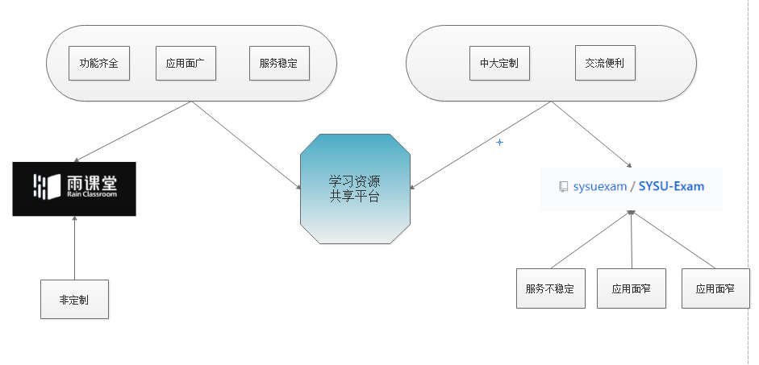

* 技术方案

  项目成果最终会运行于IOS或安卓移动平台，前端UI设计、后端数据库、业务逻辑等技术细节待进一步规划。  
