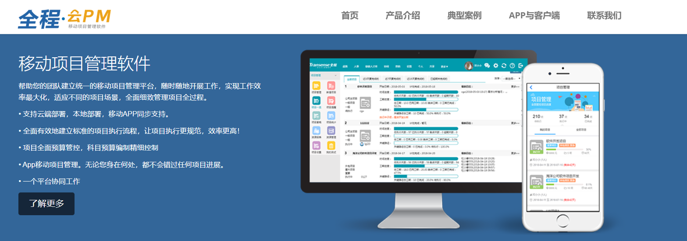
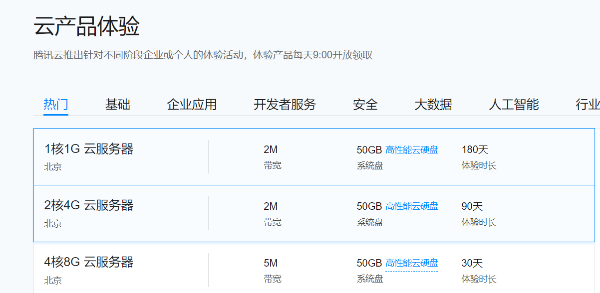
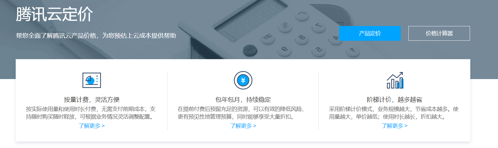
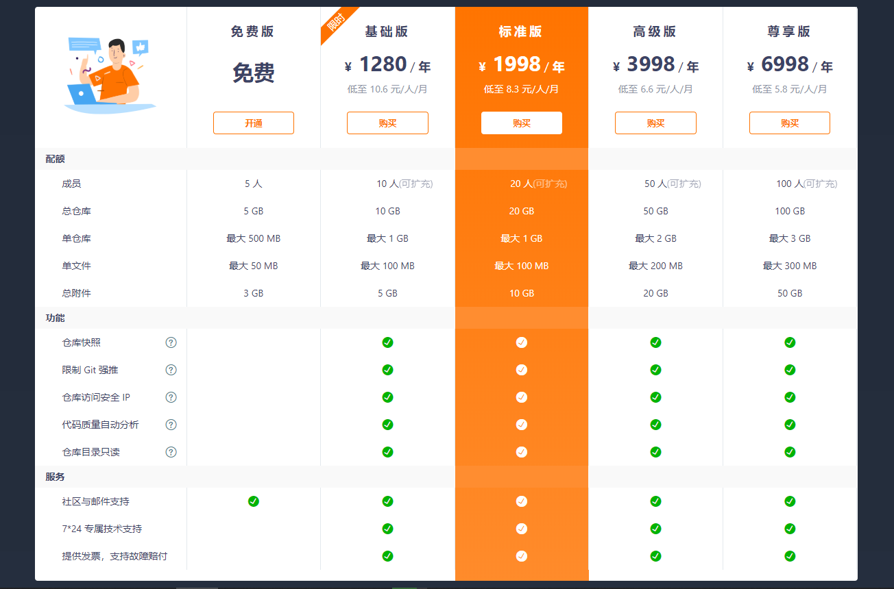

# 云与移动项目管理软件盈利模式-免费试用+按月付费

以下模式针对的是软件的基础功能部分，不包含增值功能与定制化等服务

### 30天免费试用

免费试用是一个非常常见的吸引用户的方式：

* 对于用户而言，30天的试用期不仅仅降低了成本，也获得了一段缓冲区来看软件是否满足自己的需求。

* 对于项目方，目前云计算市场已经进入到了价格战的阶段，前期必须依靠一定的让利才能占据市场份额，30天免费试用是不错的方案。

  例如全程云PM提供的移动项目管理软件，就使用的是这种模式

  

  

  而像国内云计算巨头腾讯云对于个人服务器甚至可以提供180天的云服务器，当然这只是基础云资源，与我们提出的移动项目管理软件不太相同

  

  在试用阶段可以免费使用项目管理、资源管理、预算管理、任务管理、费用报销、合同管理等基础功能，但是对于特色增值工具与定制化服务仍需付费

### 按月付费

试用期之后需要进入付费阶段以保证盈利，腾讯云等云计算商的方案是按量计费与包年包月并行

这也是云计算的基本计费方式，但是由于服务性质的不同，按量计费并不太适合我们的项目，因此主要采用的是包年包月的模式

以码云企业版举例，虽然不按量计费，我们可以设置多种价位来提供给有不同需求的用户，尽可能满足客户要求，并避免资源浪费

